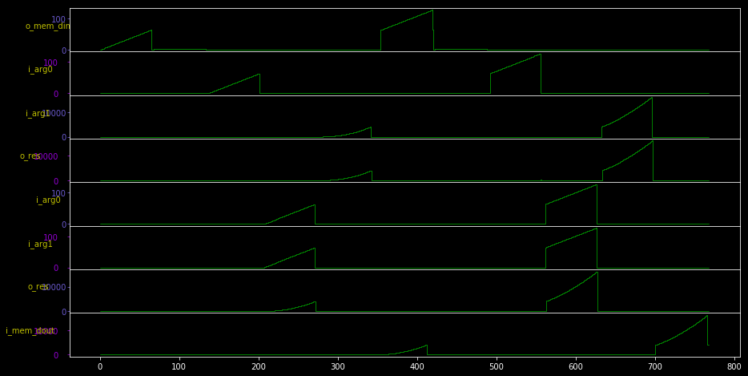

# Bundle

Bundle is a hardware architecture designed to accelerate array computing on
FPGA. It is similar to [NumExpr](https://numexpr.readthedocs.io) and has the
same use case: it can speed up computations when applied to large arrays.  NumPy
arrays are split into chunks and offloaded to the FPGA which can operate in
parallel on each chunk.

Right now, the goal is to map this hardware to the [PYNQ-Z1](http://www.pynq.io)
board. But if you don't have this board and want to see how things work, the
whole system can be simulated entirely in Python (it is also very convenient for
exploring new architectures). For that I have created a small Hardware
Description Language called [PyClk](https://github.com/davidbrochart/pyclk). It
can generate this kind of waveforms:

# Architecture

The hardware is intentionally kept simple, and consists of:
- memories: they are used to cache chunks of the host arrays in the FPGA before
  making operations on them, and write chunks of the result of these operations
before copying them to the host DDR memory.
- DDR <-> FPGA streamers: they handle data copy from the DDR memory to the FPGA
  memories (to get the function arguments) and from the FPGA memories to the DDR
memory (to return the function results).
- iterators: they stream data from FPGA memories, feed it to functions, and
  stream the function's result to another FPGA memory.
- functions: they take data in and produce a result, e.g. the sum of two
  numbers.

Streamers, iterators and functions can connect to any memory, but the hardware
doesn't have a clue what it is doing: it is just a bundle of wires. All the
knowledge comes from the software, which maps a high-level expression down to
low-level basic operations.

The software is responsible for orchestrating the evaluation of an expression,
e.g. `a * b + c`. It breaks down the expression into a sequence of functions
(here `tmp = a * b` then `tmp + c`). It allocates FPGA memory for the
evaluation, copies chunks of the data from the host DDR memory to the FPGA
memory, schedules operations, and copies back the result to the host DDR memory.
Since the FPGA can execute many operations in parallel, the scheduler uses
asynchronous programming (and `asyncio` in particular) to manage memory copy and
computation tasks.

# Install

You will need PyClk to simulate the hardware:

`pip install git+https://github.com/davidbrochart/pyclk`

Bundle can be installed directly through GitHub: `pip install
git+https://github.com/davidbrochart/bundle`

Or you can clone this repository and `pip install -e bundle`
